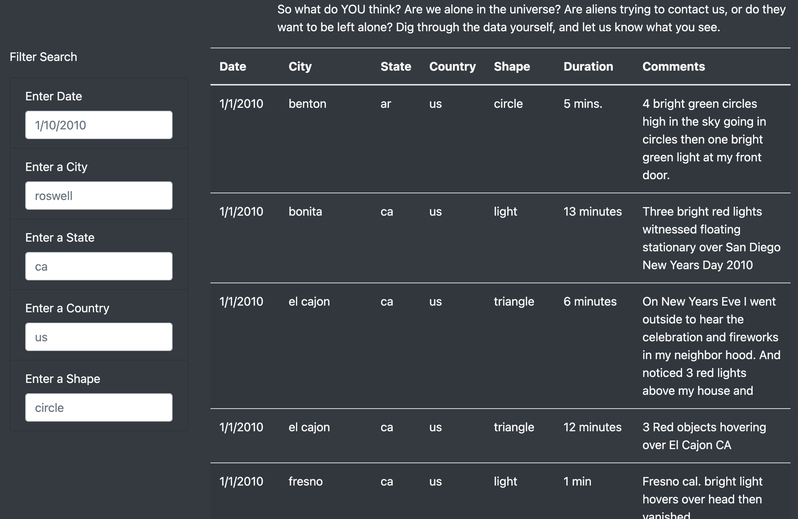
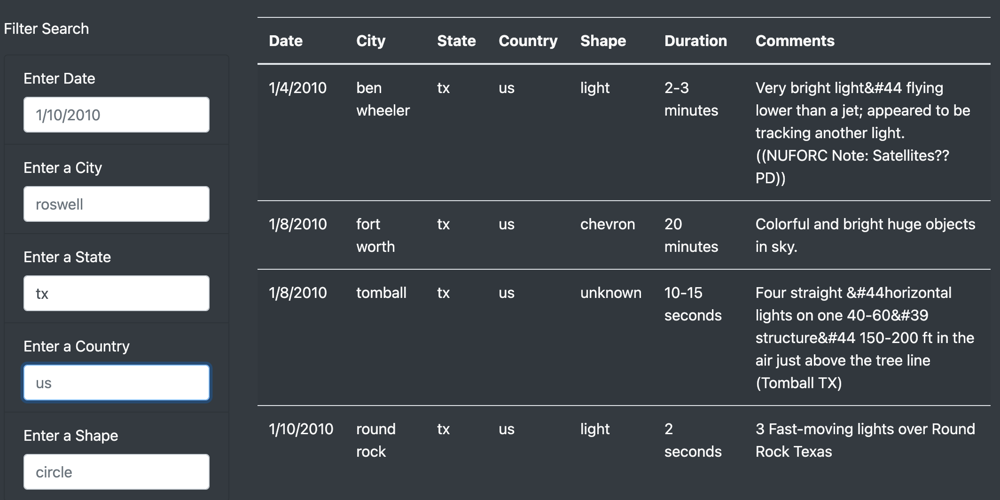
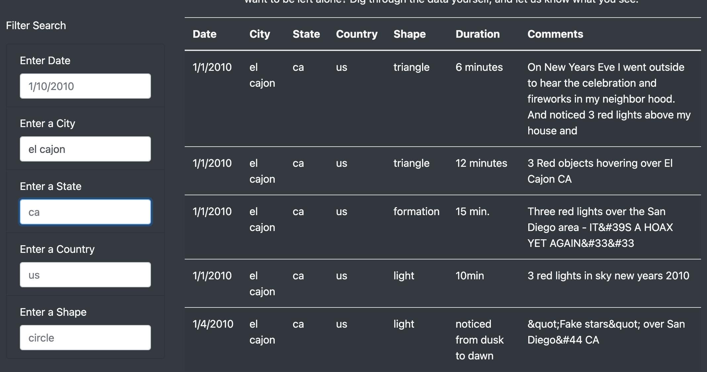
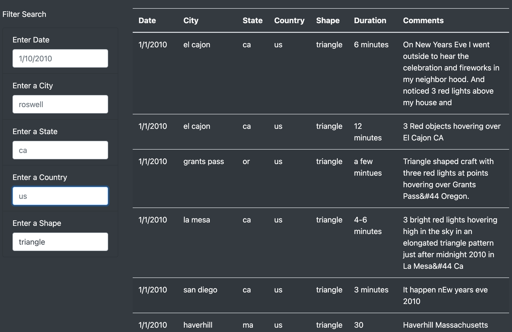

# UFOs

## Project Overview

The purpose of this analysis is to create an interactive and dynamic webpage to visualize data of UFO sightings.

This image shows the appearance of the top of the webpage.

## Results

This is the table of UFO data with no filters applied.

Here we can see the table data filtered by state in the text boxes on the lefthand side. This shows only the results in Texas.

Here we can see the table data filtered by city in the text boxes. This shows only the results in El Cajon, California.

Here we can see the table data filtered by shape in the text boxes. This shows only the results recorded as a triangle shape.

The table can also be filtered by the date and country columns.

## Summary

The input boxes successfully filter the table of UFO data. One drawback is that minor formatting differences in the input boxes prevent data from appearing. An additional improvement would be for a list of possible autofill inputs to appear while typing in the input boxes. Then it would be easier to avoid getting an empty table as a result of entering a date, city, country, state, or shape that isn't in the table at all. Another improvement would be to make the input boxes case insensitive, also for ease of use with the inputs.
